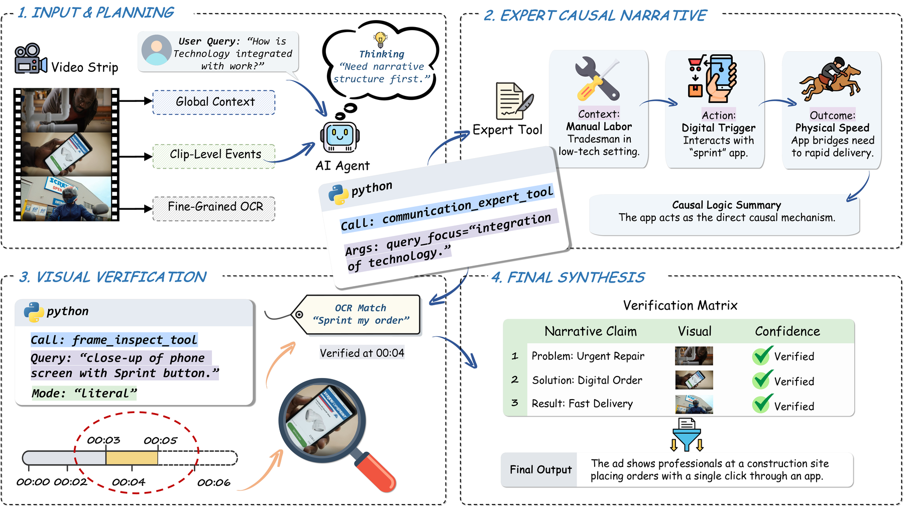
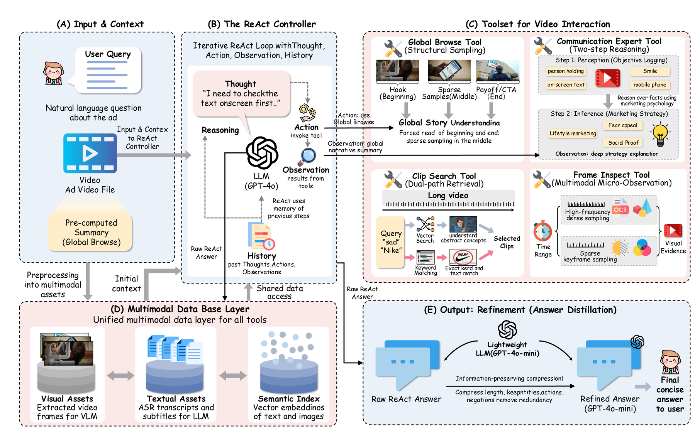
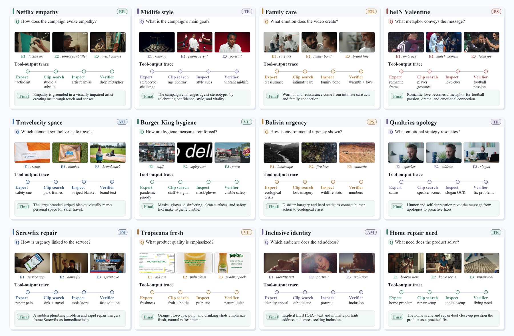
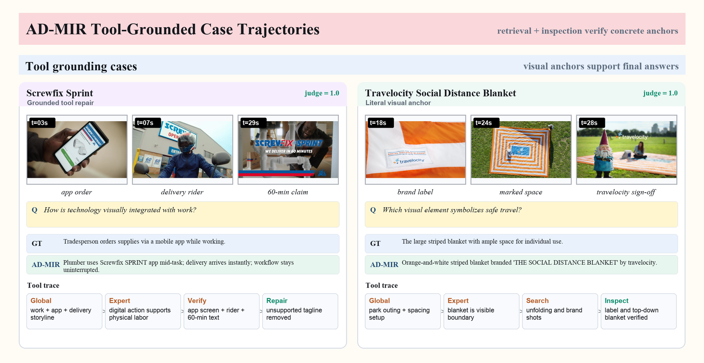
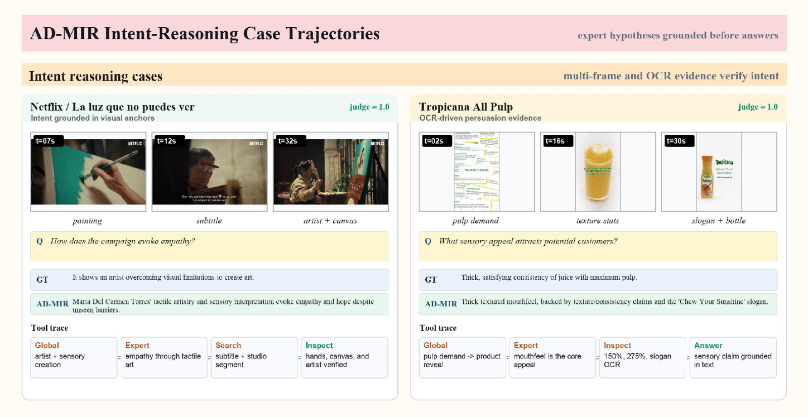

# AD-MIR

**AD-MIR: Bridging the Gap from Perception to Persuasion in Advertising Video Understanding via Structured Reasoning**

<p align="center">
  
</p>

<p align="center">
  <em>Give AD-MIR your ad video and your question; get a concise answer with an auditable evidence trace.</em>
</p>

AD-MIR is a tool-grounded reasoning system for advertising videos. A user provides:

1. an advertising video file, and
2. a natural-language query about the ad.

AD-MIR builds multimodal memory from the video, browses the global narrative, searches relevant clips, inspects frames when literal visual evidence is needed, asks an advertising communication expert to reason about persuasive intent, and returns an answer plus the tool trajectory that supports it.

This public repository is provider-neutral. It does **not** include private API keys, local server paths, model weights, raw videos, dataset-specific downloaders, evaluation scripts, or generated evaluation outputs.

## Visual Tour

### Workflow

<p align="center">
  
</p>

AD-MIR turns a video into structured multimodal memory, then answers through a fixed tool-grounded workflow: global browse, expert reasoning, targeted retrieval, frame inspection, evidence verification, and concise refinement.

### Architecture

<p align="center">
  
</p>

The ReAct controller interacts with a shared multimodal database through four tools: Global Browse, Communication Expert, Clip Search, and Frame Inspect.

### Example Reasoning Traces

<p align="center">
  
</p>

The case gallery illustrates how AD-MIR records intermediate evidence: retrieved frames, inspected visual/OCR anchors, expert observations, answer repair, and the final response.

<p align="center">
  
  
</p>

## What Is Inside

- `scripts/run_custom_ad.py`: one-command entry point for a user video and query.
- `admir/agent.py`: ReAct controller, evidence verification, and answer refinement.
- `admir/build_database.py`: global browse, clip search, frame inspection, subject registry activation, and vector database construction.
- `prepare_captions.py`: video decoding, clip captioning, subject registry construction, and database initialization.
- `add_asr_ocr.py`: timestamped ASR augmentation and optional offline OCR utility.

## Installation

```bash
conda env create -f admir.yml
conda activate admir
pip install -r admir_requirements.txt
```

You also need `ffmpeg` available on your `PATH`.

## Configure Runtime Models

AD-MIR uses OpenAI-compatible chat/VLM endpoints and either local or remote embeddings. Model names are intentionally not hard-coded in this release. Copy `.env.example` and fill in your own endpoints and deployments:

```bash
cp .env.example .env
source .env
```

Minimal variables:

```bash
export OPENAI_API_KEY="<your-api-key-or-empty-for-local>"
export OPENAI_BASE_URL="<openai-compatible-chat-or-vlm-endpoint>"

export ADMIR_DEFAULT_LMM_MODEL="<your-default-lmm-or-vlm>"
export ADMIR_CAPTION_VLM_MODEL="<your-caption-vlm>"
export ADMIR_ORCHESTRATOR_LLM_MODEL="<your-controller-llm>"
export ADMIR_FRAME_INSPECT_MODEL="<your-frame-inspection-vlm>"
export ADMIR_COMMUNICATION_EXPERT_MODEL="<your-expert-llm-or-vlm>"
export ADMIR_REFINE_LLM_MODEL="<your-refinement-llm>"

export ADMIR_EMBEDDING_BACKEND="hf"
export ADMIR_HF_EMBEDDING_MODEL="<local-or-hub-embedding-model>"
export ADMIR_HF_EMBEDDING_DIM="1024"

# Optional but recommended when ads contain speech.
export ADMIR_ASR_MODEL="<local-or-hub-asr-model>"
```

Set `ADMIR_STRICT_PAPER_MODE=1` only when you want fail-fast checks that every component model has been explicitly configured.

## Run On Your Own Ad

Put any supported video file somewhere outside the repository, then ask a question about the ad:

```bash
python scripts/run_custom_ad.py \
  --video /path/to/your_ad.mp4 \
  --query "What visual evidence supports the ad's main persuasive message?" \
  --output_db_root ./data/video_database \
  --results_dir ./results/custom_ad
```

The command performs the whole pipeline:

```text
your video + query
  -> clip captions and subject registry
  -> vectorized multimodal database
  -> optional ASR transcript
  -> AD-MIR tool-grounded reasoning
  -> answer.json and trace.md
```

Outputs are written under `./results/custom_ad/<video_name>/`:

- `answer.json`: final answer, raw answer, model/tool history, database paths, and any runtime error.
- `trace.md`: readable tool trajectory for inspecting how AD-MIR reached the answer.

If you do not have an ASR model configured, AD-MIR still runs on visual evidence and simply records ASR as skipped. To force a clean rebuild after changing model settings:

```bash
python scripts/run_custom_ad.py \
  --video /path/to/your_ad.mp4 \
  --query "Who is the ad trying to persuade, and how?" \
  --force_rebuild
```

For videos with no relevant speech, pass `--skip_asr`. Offline OCR is disabled by default because AD-MIR verifies text through targeted frame inspection during reasoning; pass `--offline_ocr` only when you explicitly want pre-computed OCR stored in the database.

## Advanced Pipeline Control

The one-command runner is the recommended path. If you want to inspect each stage manually, you can call the components directly:

```bash
python prepare_captions.py \
  --video_path /path/to/your_ad.mp4 \
  --output_root ./data/video_database \
  --workers 4

python add_asr_ocr.py \
  --video_db_root ./data/video_database \
  --raw_video_root /path/to/video_folder \
  --asr_model "$ADMIR_ASR_MODEL" \
  --skip_ocr

python scripts/run_custom_ad.py \
  --video /path/to/your_ad.mp4 \
  --query "What product benefit does the ad emphasize?"
```

## Repository Hygiene

The `.gitignore` excludes model weights, raw videos, generated video databases, logs, caches, and run outputs. Keep only lightweight source code, documentation, examples, and figures in commits.

## Citation

```bibtex
@inproceedings{admir2026,
  title     = {AD-MIR: Bridging the Gap from Perception to Persuasion in Advertising Video Understanding via Structured Reasoning},
  booktitle = {Proceedings of the International Conference on Machine Learning},
  year      = {2026}
}
```

## License

This project is released under the MIT License.
